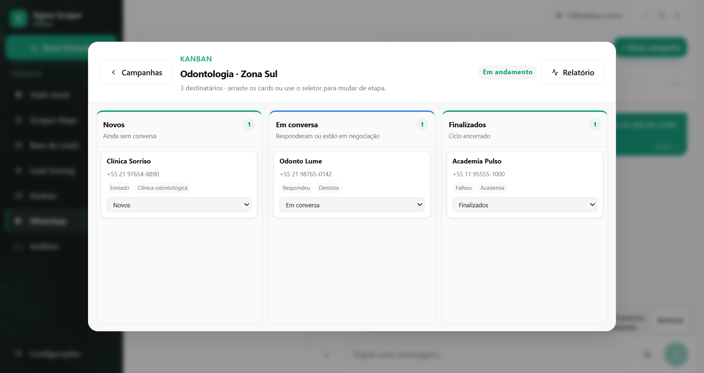
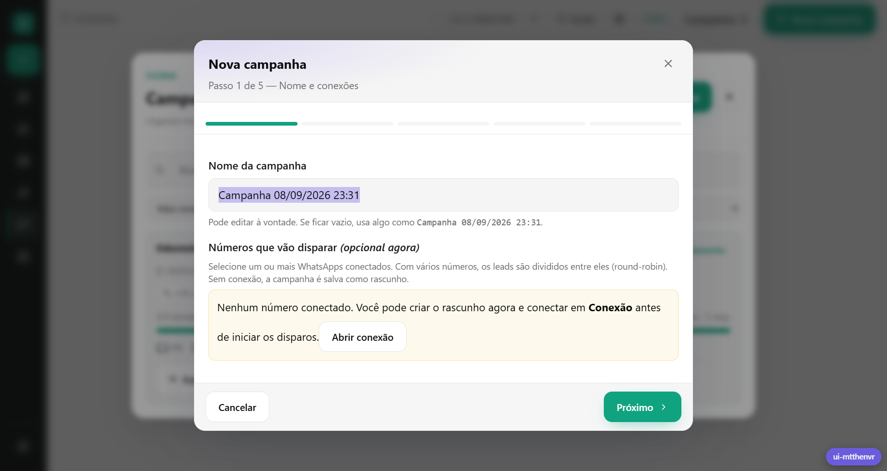

# P4J3 Prospect

Desktop local-first para transformar pesquisas do Google Maps em uma operação de prospecção: encontrar empresas, organizar leads, priorizar oportunidades e iniciar conversas pelo WhatsApp.

[](LICENSE)

## Fluxo do produto

```text
Google Maps → base de leads → lead scoring → WhatsApp → campanha/Kanban → métricas
```

O app combina scraping, tratamento de dados, análise comercial e execução de campanhas em uma única aplicação Electron para Windows.

## Recursos

### Pesquisa e base de leads

- Pesquisa por nicho, bairro ou cidade no Google Maps, com paginação e coleta dos dados públicos disponíveis.
- O modal de extração separa nicho, município digitado e UF selecionada, deixando a busca mais rápida de revisar.
- Campos de negócio como nome, categoria, telefone, site, Instagram, e-mail, avaliação, endereço e coordenadas.
- Deduplicação por negócio e normalização de categorias; variações como “dentista”, “clínica odontológica” e “ortodontia” são agrupadas em **Odontologia**.
- Extrações de planilhas/CSV/XLSX ficam fora da lista de extrações reais do Maps.
- Visualização em tabela ou mapa Leaflet com camada **Ruas**, pins com coordenadas e indicador de precisão.
- Filtros, seleção em lote, exportação CSV/XLSX e filtros rápidos nas últimas extrações (**Todos**, **com site**, **com telefone** e **com e-mail**).
- Site aparece como ícone web (com URL no hover e abertura em janela interna); telefone pode iniciar uma conversa mesmo fora da lista de contatos.

### IA e agentes

- **Inteligência Artificial** (menu 7): provedor (DeepSeek, OpenRouter, NVIDIA, OpenCode ou API própria), chave cifrada pelo Windows, perfil do seu negócio e aprendizado das campanhas.
- **Agentes** (menu 8): Triagem, Pesquisador, Presente de Valor, Copywriter, Respostas e Analista, cada um com liga/desliga, modo automático e limite diário de uso da API.
- **Triagem**: classifica cada lead em sem site, site fraco/fora do ar, WhatsApp sem automação, já automatizado e alto potencial; monta a entrevista de qualificação e um diagnóstico gratuito para abrir a conversa entregando valor.
- **Localizador** (pino no Scraper Maps): busca na web, CNPJ, quadro de sócios (dono), abordagem e chance de fechar.
- **Auto-aperfeiçoamento**: o Analista estuda os resultados e escreve um playbook que os outros agentes seguem.
- **Status em tempo real**: enviado, entregue, lido, respondeu ou pediu para sair aparecem na hora no Scraper (aba Contatados), na Base de Leads e no WhatsApp.

Sugestões para o Kanban com IA: [docs/sugestoes-kanban-ia.md](docs/sugestoes-kanban-ia.md).

### Lead Scoring

- Auditoria do site do lead para sinais técnicos e comerciais: HTTPS, responsividade, pixel, WhatsApp, presença digital e qualidade do site.
- Score, prioridade, argumentos de abordagem e mensagem sugerida para WhatsApp.
- Grupos salvos por pesquisa/filtro para trabalhar a lista por etapas.
- Análise opcional com **OpenRouter como padrão**, NVIDIA Build como alternativa e OpenCode/custom API quando configurados; há fallback local quando não existe chave disponível.

### WhatsApp

- Conexão de múltiplos números por QR Code usando Baileys ou Meta Cloud API.
- Conversas, contatos, grupos, etiquetas, mensagens, mídia, áudio e gatilhos.
- Nova conversa por telefone digitado, mesmo que o número ainda não esteja na lista; envio de texto, áudio, vídeo, PDF, documentos e arquivos ZIP/RAR/7Z.
- Modo streaming opcional para borrar números de telefone na interface, inclusive em contatos salvos.
- Campanhas com mensagem variável, intervalo, agendamento e limite diário por conexão.
- Uma campanha pode ser criada como **rascunho** mesmo sem WhatsApp conectado; a conexão é exigida apenas para iniciar os disparos.

### Campanhas e Kanban

- Campanhas por lista de leads, com relatório de envio, entrega, leitura, respostas e tempo de resposta.
- Kanban configurável com regras simples para eventos como mensagem enviada, resposta, venda e recusa.
- Adição manual de lead por telefone ou conversa do WhatsApp, com etapa inicial e valor do negócio.
- Lembretes podem ser criados para qualquer contato, com ou sem cartão no Kanban; quando há cartão, a etapa e o lembrete são sincronizados.
- Valores ganhos e pendentes, vendas fechadas, datas de mensagem/resposta e lembretes aparecem no resumo comercial da Visão Geral.
- Mova cards por drag-and-drop ou seletor; leads apagados da base autoritativa não voltam para o quadro.





### Interface e operação

- Shell visual baseado no Open Design do produto, com Visão Geral, Scraper Maps, Base de Leads, Lead Scoring, Kanban, WhatsApp e Configurações.
- Painel administrativo com navegação por ícones, análise da base iniciando minimizada e visão geral minimalista com métricas e sino de pendências.
- Atualizações automáticas na versão instalada via GitHub Releases.
- Dados da aplicação e sessões do WhatsApp ficam no perfil local do Electron; chamadas externas acontecem apenas para Maps, sites analisados, WhatsApp e provedores de IA configurados.

## Download para Windows

**[Baixar a versão mais recente](https://github.com/P4J3-1/p4j3-prospect/releases/latest)**. Cada versão traz:

- `P4J3-Prospect-<versão>-x64.exe` — instalador NSIS recomendado.
- `P4J3-Prospect-<versão>-x64.zip` — pacote portátil.
- `latest.yml` e `.blockmap` — metadados usados pelo atualizador automático.

Após instalar, abra o P4J3 Prospect e comece por **Nova Extração**. Para campanhas, conecte um número em **WhatsApp → Sessão** ou salve primeiro um rascunho e conecte depois.

> O atualizador automático funciona na versão instalada pelo NSIS. Com o updater ativo, instalações anteriores detectam a nova versão e a baixam pelo próprio app; instalações `win-unpacked`, portáteis ou com o updater indisponível precisam do download manual. `win-unpacked` é uma saída de teste local e não deve ser usada para validar atualização in-place.

## Desenvolvimento

### Requisitos

- Windows 10/11 64-bit.
- Node.js 20 ou superior.
- Acesso à internet para Maps, sites analisados, downloads e WhatsApp.

### Instalar e executar

```bash
git clone https://github.com/P4J3-1/p4j3-prospect.git
cd p4j3-prospect
npm install
npm start                 # builda o renderer e abre o Electron
```

Para trabalhar apenas no front-end:

```bash
npm run dev:renderer      # Vite em http://localhost:5173
```

### Comandos úteis

```bash
npm test                  # suíte Node --test
npm run build:renderer    # build do React/Vite
npm run qa:ui             # captura visual das rotas e fluxos principais
npm run build:win         # instalador NSIS + ZIP em dist/
```

O build de produção usa Electron Builder e publica artefatos Windows x64 conforme o campo `build.publish` do `package.json`.

## Estratégia de prospecção

Veja [docs/estrategia-prospeccao.md](docs/estrategia-prospeccao.md): lista qualificada, mensagem de permissão com variações, follow-up automático, descadastro e aquecimento de número.

## Publicar uma nova versão

```bash
npm run release                        # correção: 1.4.0 → 1.4.1
npm run release -- minor               # novidade: 1.4.0 → 1.5.0
npm run release -- patch "mensagem"    # inclui alterações ainda não commitadas
```

O script roda os testes, sobe a versão, cria commit + tag, envia ao GitHub e acompanha o build. O GitHub Actions gera o instalador e publica a release; os apps instalados se atualizam sozinhos.

## Abrir pelo código (Windows)

Dê dois cliques em `iniciar.cmd` (ou rode-o no terminal): ele baixa as atualizações, instala dependências novas e abre o app.

## Estrutura principal

```text
main.js                            Processo Electron e IPC seguro
preload.js                         Ponte entre renderer e processo principal
renderer/                          React + Vite + interface Open Design
lead-scoring/                      Crawler, score, grupos e exportação
campaigns/                         Store, scheduler, analytics e Kanban
whatsapp/                          Providers, autenticação e normalização
scripts/capture-open-design-ui.js  QA visual determinístico
test/                              Testes unitários e de integração local
```

## Contribuir e reportar problemas

- Abra uma Issue no repositório com versão, sistema operacional, passos para reproduzir e logs relevantes.
- Pull requests devem manter `npm test` e `npm run qa:ui` verdes.

## Licença

MIT — veja [LICENSE](LICENSE). Baseado no projeto open source Sigma GMaps Scraper (Ferdy/Feralgorithms e colaboradores); o aviso de copyright original é mantido conforme a licença MIT.
